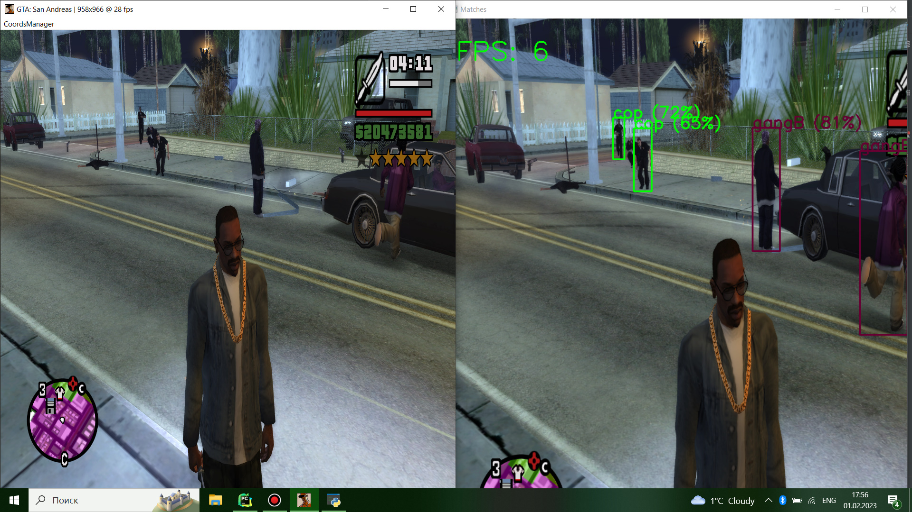

<h1>Grand Theft Auto Object Detection</h1>
<video src='./gtaSA.mp4' width=180/> 
<h2>Introduction</h2>

Implementation of object detection on the model yolo v5 based on images obtained from the game Grand Theft Auto: San Andreas. 
Datebase consists of 1397 screenshots from the game. I have divided the images into 4 groups:

<ul>
<li>Cops (this includes all kinds of services that perform the role of the police) </li>
<li>GangB(Ballas Gang)  </li>
<li>GangV (Los Santos Vagos Gang) </li>
<LI>Corpses (this includes all the characters who died) </li>
</ul>
<h2>Training</h2>

The layout of the network was made on the website <a href="https://universe.roboflow.com/riumin/gtasas#">https://universe.roboflow.com/riumin/gtasas</a>(<small>this is my already marked up project</small>). 
I will omit the training process, but I conducted it on .
<h2>The characteristics of my laptop</h2>
<ul>
    <li>NVIDIA GeForce MX150</li>
    <li>Intel(R) Core(TM) i3-8130U CPU @ 2.20GHz 2.21 GHz</li>
    <LI>RAM 12GB DDR3</li>
</ul>
<h2>Software implementation</h2>
-The <a href="https://github.com/RiuminIa/GTA_ObjectDetectionWithYoloV5/blob/master/WindowCapture.py#">windowCapture</a> class contains functions to get a screenshot of an image of programs running on the computer. 
-The <a href="https://github.com/RiuminIa/GTA_ObjectDetectionWithYoloV5/blob/master/peopleDetectedGta.py">peopleDetected</a> class contains the basic functionality of object detection. 
-The program uses the framework <a href="https://pytorch.org/#">PyTorch</a> to work with the neural network and the library <a href="https://opencv.org/#">openCV</a> to work with images. 
In this repository the code with which you can test the obtained scales. On my slow laptop I managed to achieve 8-10 fps. Taking into account the fact that the <a href="https://github.com/RiuminIa/GTA_ObjectDetectionWithYoloV5/blob/master/peopleDetectedGta.py#L10">GPU</a> is involved.

<h2>Examples</h2>

<h2>Conclusion</h2>

Most successfully detected cops and corpses. This is due to the fact that for these classes had the most images. 
Also a very high percentage of false positives, as I in my data base almost no images in which there are no classes.

